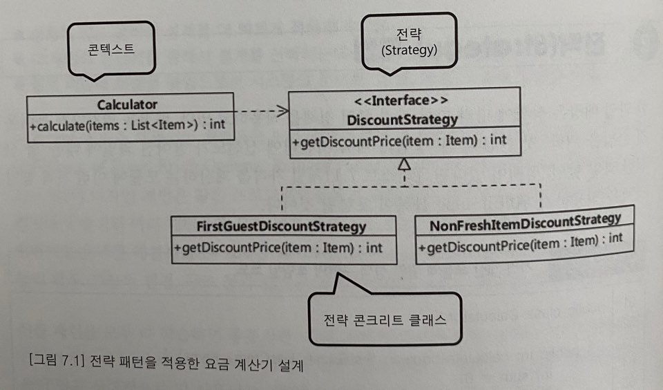
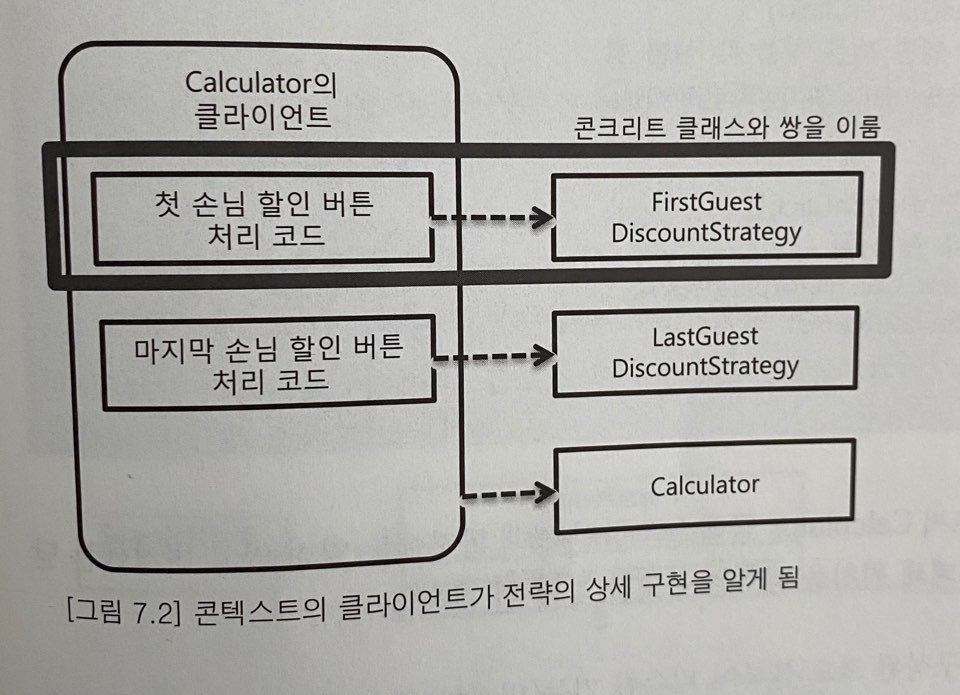
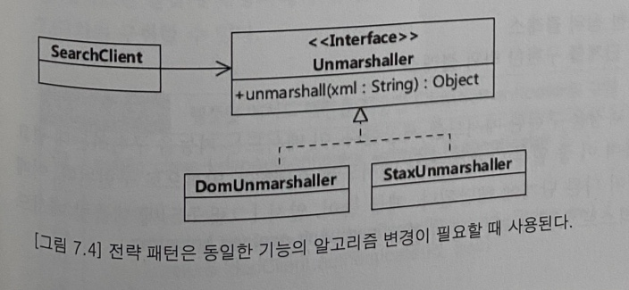

### 2. 전략(Strategy) 패턴

예시: 한 과일매장은 상황에 따라 다른 가격 할인 정책을 적용 (첫 손님 할인 등등)

```java
public class Calculator {
    
    public int calculate(boolean firstGuest, List<Item> items) {
        int sum = 0;
        for (Item item : items) {
            if (firstGuest) 
                sum += (int) (item.getPrice() * 0.9); // 첫 손님 10% 할인
            else if (! item.isFresh())
                sum += (int) (item.getPrice() * 0.8); // 덜 신선한 것 20% 할인
            else
                sum += (int) item.getPrice();
        }
        return sum;
    }
}
```
문제점:
- 서로 다른 계산 정책들이 한 코드에 섞여서, 정책 추가될 수록 코드 분석 어려워짐
- 가격 정책이 추가될 때마다 calculate 메서드 수정 어려워짐 (e.g. 마지막 손님 50% 할인 -> lastGuest 같은 파라미터 추가 필요)

솔루션:
- 가격 할인 정책을 별도 객체로 분리 (= 전략 패턴)  

  
[그림7.1] 전략 패턴을 적용한 요금 계산기 설계

- `DiscountStrategy` 인터페이스는 상품의 할인 금액 계산을 추상화, 각 콘크리트 클래스는 상황에 맞는 할인 계산 알고리즘을 제공 (한편 `Calculator` 클래스는 가격 합산 계산의 책임)
- 전략 패턴은 특정 콘테스트에서 알고리즘(전략)을 별도로 분리하는 설게방법  
    - 가격 할인 알고리즘(계산 방법)을 추상화한 `DiscountStrategy` = 전략(Strategy)
    - 가격 계산 기능 자체의 책임 갖는 `Calculator` = 콘텍스트(Context)
- 전략 패턴에서 콘텍스트는 사용할 전략을 직접 선택x (콘텍스트 클라이언트가 콘텍스트에 사용할 전략을 전달)  
즉 DI(의존 주입) 사용하고, 전략이 어떤 메서드를 제공할지 여부는 콘텍스트가 전략을 어떻게 사용하는냐에 따라 달라짐

```java
public class Calculator {
    
    private DiscountStrategy discountStrategy;
    
    public Calculator(DiscountStrategy discountStrategy) {
        this.discountStrategy = discountStrategy;
    }

    public int calculate(boolean firstGuest, List<Item> items) {
        int sum = 0;
        for (Item item : items) {
            sum += discountStrategy.getDiscountPrice(item);
        }
        return sum;
    }
}

public interface DiscountStrategy {
    int getDiscountPrice(Item itme);
}
```

- 생성자를 통해서 사용할 전략 객체를 전달받고, 
- calculate() 메서드에서 각 item 가격 계산할때 전략 객체를 사용

> 한편, 전체 금액에 대한 할인 정책이 필요하다면 `DiscountStrategy` 인터페이스
```java
public interface DiscountStrategy {
    int getDiscountPrice(Item itme);
    int getDiscountPrice(int totalPrice);
}
```
> 또는, 전체 금액 할인 정책을 위한 전략을 별도 인터페이스로 분리는 가능
```java
public interface ItemDiscountStrategy {
    int getDiscountPrice(Item itme);
}

public interface TotalPriceDiscountStrategy {
    int getDiscountPrice(int totalPrice);
}
```

전략 객체는 콘텍스트를 사용하는 클라이언트에서 직접 생성 (e.g. 첫번째 손님에 대해 할인해주는 `FirstGuestDiscountStrategy` 구현 클래스)
```java
public class FirstGuestDiscountStrategy implements DiscountStrategy {
    @override
    public int getDiscountPrice(Item item) {
        return (int) (item.getPrice() * 0.9);
    }
}
```
> 사용 되는 코드 예시:
```java
private DiscountStrategy strategy;

public void onFirstGuestButtonClick() {
    // 첫 손님 할인 버튼 누를때 생성 됨
    strategy = new FirstGuestDiscountStrategy();
}

public void onCalculationButtonClick() {
    // 계산 버튼 누를때 실핼 됨
    Calculator cal = new Calculator(strategy);
    int price = cal.calculate(items)
}
```

  
[그림 7.2] 콘텍스트의 클라이언트가 전략의 상세 구현을 알게 됨

- 콘텍스트의 클라이언트가 인터페이스가 아닌 상세 구현을 아는것은 문제x  
전략의 콘크리트 클래스와 클라이언트 코드 **쌍**을 이루기 때문에 유지보수에서 유리 (코드 응집 효과)
- 전략패턴 이점: 콘텍스트 코드 변경없이 새로운 전략 추가 가능 (e.g. 마지막 손님 대폭 할인 정책, `Calculator` 클래스 코드변경x)
    - 개방-폐쇄 원칙 따르는 구조 가능
```java
private DiscountStrategy strategy;

public void onLastGuestButtonClick() {
    // 마지막 손님 대폭 할인 버튼 누를 때 생성됨
    strategy = new LastGuestDiscountStrategy();
}

public void onCalculationButtonClick() {
    // 계산 버튼 누를때 실핼 됨
    Calculator cal = new Calculator(strategy);
    int price = cal.calculate(items)
}
```


완전히 동일한 기능을 제공하지만 성능의 장단점에 따라 알고리즘을 선택해야하는 경우에도 전략패턴을 사용
  
[그림 7.4] 전략 패턴은 동일한 기능의 알고리즘 변경이 필요할땨ㅐ 사용된다.
