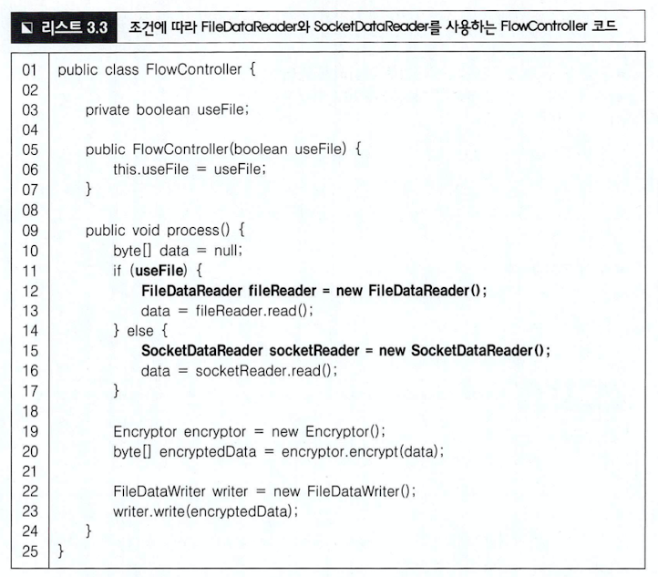

# 3장 다형성과 추상 타입

## 1. 상속 개요
한 타입을 그대로 사용하면서 구현을 추가할 수 있도록 해주는 방법.

## 2. 다형성과 상속
다형성: 한 객체가 여러 가지(poly) 모습(morph)을 갖는다. 모습은 타입. 한 객체가 여러 타입을 가질 수 있다는 뜻.

### 2.1. 인터페이스 상속과 구현 상속

타입 상속은 인터페이스 상속과 구현 상속으로 구분 가능.

인터페이스 상속은 순전히 타입 정의만을 상속 받는 것.

구현 상속은 클래스 상속을 통해 이뤄짐. 상위 클래스에 정의된 기능을 재사용하기 위한 목적으로 사용.

## 3. 추상 타입과 유연함
추상화: 데이터나 프로세스 등을 의미가 비슷한 개념이나 표현으로 정의하는 과정.

단순히 구현 클래스로부터 추상 타입을 이끌어 내는 것만이 추상화라고 오해하면 안 된다.

### 3.1. 추상 타입과 실제 구현의 연결

### 3.2. 추상 타입을 이용한 구현 교체의 유연함
콘크리트 클래스를 직접 사용해도 문제가 없는데 왜 추상 타입을 사용하는 것일까?

→ 요구사항 변화에 잘 대응하기 위해서.

예, 파일 뿐만 아니라 소켓을 통해서 데이터를 읽어 와 암호화할 수 있도록 해달라.

데이터를 읽어오는 요구 사항의 변화가 생길 때마다 FlowController가 계속 영향을 받는다.

FlowController의 본연의 책임(흐름 제어)와 상관없는 데이터 일기 구현의 변경 때문에 FlowController도 함께 바뀌는 것이다.

어딘가에서 바이트 데이터를 읽는다는 추상화

if / else 가 남아있는 한 새로운 DataSource 구현이 필요하면 FlowController를 수정해야 한다.

ByteSource 타입의 객체를 생성하는 과정을 추상화

BySource의 종류가 변경되면, ByteSourceFactory만 변경될 뿐, FlowController 클래스는 변경되지 않는다.

FlowController 의 제어 흐름을 변경할 때, ByteSource 객체를 생성하는 부분에 영향을 주지 않는다.

두 번의 추상화

바이트 데이터를 읽기: ByteSource 인터페이스 도출
ByteSource 객체를 생성하기: ByteSourceFactory 도출

추상화는 공통된 개념을 도출해서 추상 타입을 정의해 주기도 하지만, 또한, 많은 책임을 가진 객체로부터 책임을 분리하는 촉매제가 되기도 한다.

재사용의 중요성으로 봤을 때 하위 수준의 상세 구현보다는 변하지 않는 상위 수준의 로직으 재사용할 수 있도록 설계하는 것이 중요하다.

### 3.3. 변화되는 부분을 추상화하기
요구 사항이 바뀔 때 변화되는 부분은 이후에도 변경될 소지가 많다. 이런 부분을 추상 타입으로 교체하면 향후 변경에 유연하게 대처할 수 있는 가능성이 높아진다.

추상화가 되어 있지 않은 코드는 주로 동일 구조를 갖는 if-else 블록으로 드러난다.

변화되는 부분을 추상화함으로써, 새로운 기능 추가 요구가 발생했을 때 FlowControllerdhk Application은 수정하지 않거나 수정을 최소화하면서 새로운 요구를 반영할 수 있게 되었다.

추상화를 하면 추상 타입을 '사용하는 코드(FlowController)'에 영향을 주지 않으면서 추상 타입의 실제 구현을 변경(FileByteSource에서 SocketByteSource로 변경)할 수 있다.

### 3.4. 인터페이스에 대고 프로그래밍하기
주의할 점은 유연함을 얻는 과정에서 타입(추상 타입)이 증가하고 구조도 복잡해지기 때문에 모든 곳에서 인터페이스를 사용해서는 안 된다는 것이다. 불필요하게 프로그램의 복잡도만 증가시킬 수 있다. 인터페이스를 사용해야 할 때는 변화 가능성이 높은 경우에 한해서 사용해야 한다.

### 3.5. 인터페이스는 인터페이스 사용자 입장에서 만들기

### 3.6. 인터페이스와 테스트
두 명의 서로 다른 개발자가 각각 FlowController 클래스와 FileDataReader 클래스를 개발한다고 가정.

FileDataReader가 미완성이면 테스트 불가

ByteSource 타입 객체를 받는 방식으로 구현되어 있다면

Mock 객체를 이용해서 FileDataReader의 완성 여부에 관계없이 테스트 가능.

실제 콘크리트 클래스 대신에 진짜처럼 행동하는 객체를 Mock(가짜, 모의) 객체라 부름.