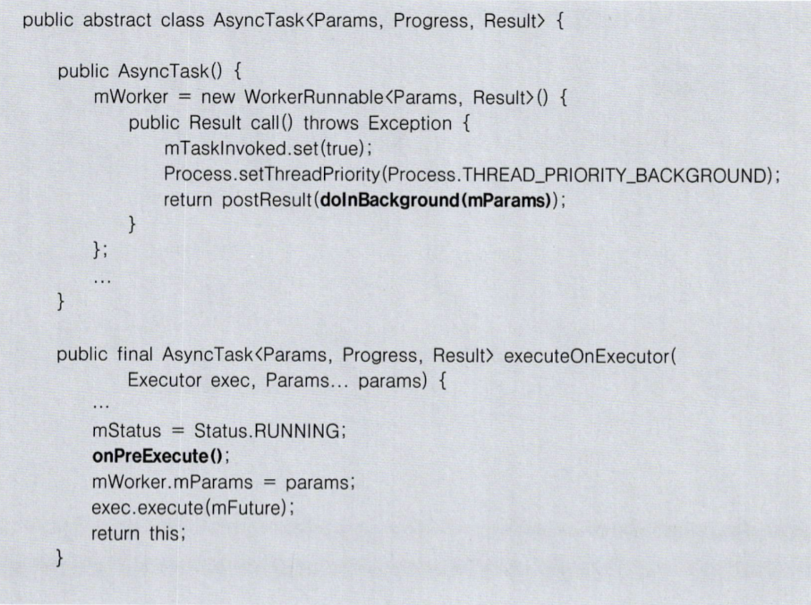
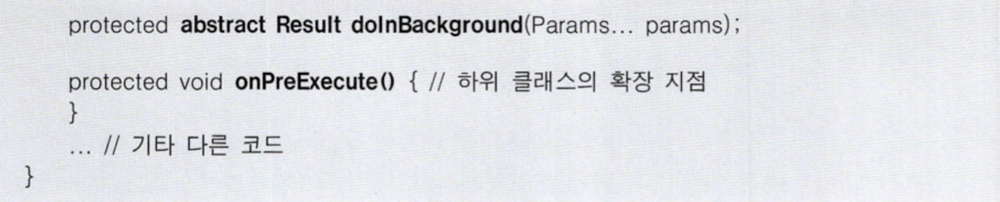

# Chapter 07 주요 디자인 패턴 - 3 템플릿 메서드 패턴

실행 과정/단계는 동일한데 각 단계 중 일부의 구현이 다른 경우에 사용할 수 있는 패턴.

다음 두 가지로 구성 됨
- 실행 과정을 구현한 상위 클래스
- 실행 과정의 일부 단계를 구현한 하위 클래스

## 3.1 상위 클래스가 흐름 제어 주체

템플릿 메서드 패턴의 특징은 하위 클래스가 아닌 상위 클래스에서 흐름 제어를 한다는 것이다. 

### 훅 메서드
추상 메서드로 정의하는 대신, 기본 구현을 제공하고 하위 클래스에서 알맞게 재정의하도록 구현할 수도 있다.

상위 클래스에서 실행 시점이 제어되고, 기본 구현을 제공하면서, 하위 클래스에서 알맞게 확장할 수 있는 메서드를 훅 메서드라고 부른다.




## 3.2 템플릿 메서드와 전략 패턴의 조합

템플릿 메서드와 전략 패턴을 함께 사용하면 상속이 아닌 조립의 방식으로 템플릿 메서드 패턴을 활용할 수 있다.

```java
public <T> T execute(TransactionCallback<T> action) throws TransactionException {
    ...
    TransactionStatus status = this.transactionManager.getTransaction(this);
    
    T result;

    try {
        result = action.doInTransaction(status)
    }
    catch (RuntimeException ex) {
        rollbackOnException(status, ex);
        throw ex;
    }
    ...
    this.transactionManager.commit(status);

    return result;
}
```