# Ch07 주요 디자인 패턴

## 2 전략 패턴

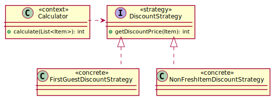

## 3 템플릿 메서드 패턴

## 4 상태 패턴

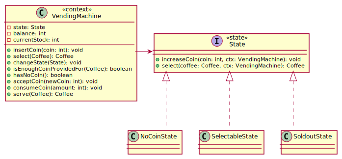

## 5 데코레이터 패턴

- 상속의 문제점: 다양한 조합 기능 확장이 요구될 때 클래스가 불필요하게 증가하는 문제
- 데코레이터: 위임하는 방식으로 기능 확장, 조립 순서의 자유도
- 키워드: **change behavior(additioanl responsibility)** at runtime without changing the component

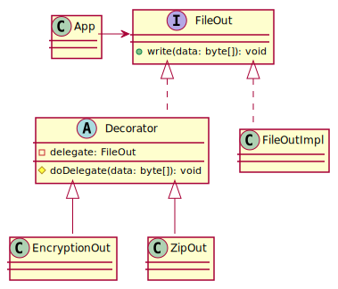

### Pizza example
- 가장 기본이 되는 클래스를 안쪽에 위치시키고 순차로 랩핑
- The ToppingDecorator is a Pizza type, and has a Pizza type

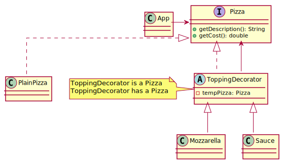

### PriceCalculator example

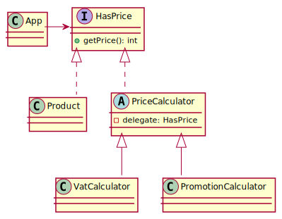

```java
HasPrice product = new Product(1, "옥토끼 별사탕", 100);
HasPrice innerCalculator = new PromotionCalculator(product, 0.3); // 30% OFF
HasPrice outerCalculator = new VatCalculator(promotionCalculator, 0.1); // 10% VAT
outerCalculator.getPrice(); // 100 * (1 - 0.3) * 0.1 = 77(원)
```

### ExtraFee example

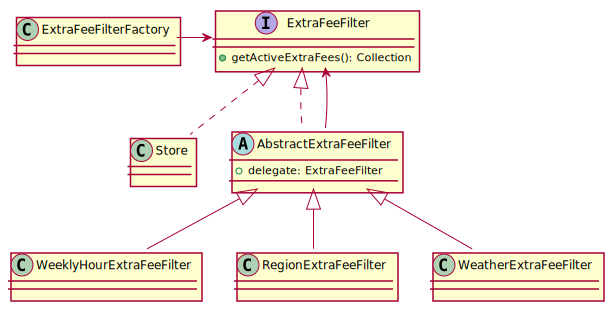

```java
ExtraFeeFilter innerFilter = new WeeklyHourExtraFeeFilter(store);
ExtraFeeFilter middleFilter = new RegionExtraFeeFilter(firstFilter, regionalExtraFeeCollector, destAddress);
ExtraFeeFilter outerFilter = new WeatherExtraFeeFilter(middleFilter, store, vroongWeatherExtraChargeDtoRepository);
outerFilter.getActiveExtraFee(); // [{name:심야할증,fee:300},{name:삼성동할증,fee:100},{name:우천할증,fee:200}]
```

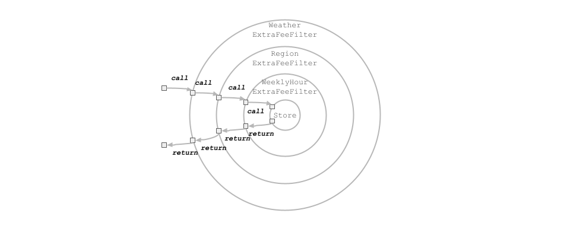

## 6 프록시 패턴

Provides a surrogate or placeholder for another object to **control access** to it.

The Proxy could interface to anything; a network connection, a large object in memory, a file, or some other resource that is expensive or impossible to duplicate. [reference](https://dzone.com/articles/using-proxy-design-pattern-in-java)

- 비싼 객체에 대한 지연 로딩; The Proxy is most commonly used in the implementation of the lazy loading of objects. I mean creating proxy objects in place of full real objects until it is actually needed.
- Proxy 객체가 Real 객체를 가지고 있음

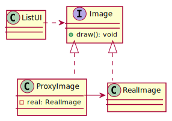

### PremiumService example

- 보호된 리소스에 대한 접근 제어; The Proxy can also be used to add an additional layer of security around the real object.

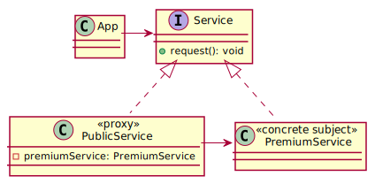

### Multitenancy Datasource example

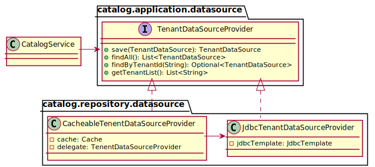

```java
@Component
@Primary
public class CacheableTenantDataSourceProvider implements TenantDataSourceProvider {
  @Override
  @SuppressWarnings("unchecked")
  public List<TenantDataSource> findAll() {
    Cache.ValueWrapper value = cache.get(CacheKey.TENANT_DATA_SOURCE_ALL);
    if (value != null) {
      return (List<TenantDataSource>) value.get();
    }

    List<TenantDataSource> configList = this.delegate.findAll();
    this.cache.put(CacheKey.TENANT_DATA_SOURCE_ALL, configList);

    return configList;
  }
}
```

## 7 어댑터 패턴

- An adapter call the adaptee, calls indirectly
- Make incompatible objects compatible
- Not adding behavior, just make it interoperable

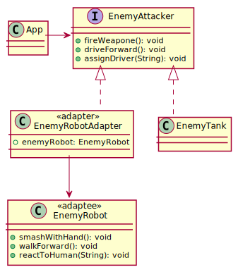
