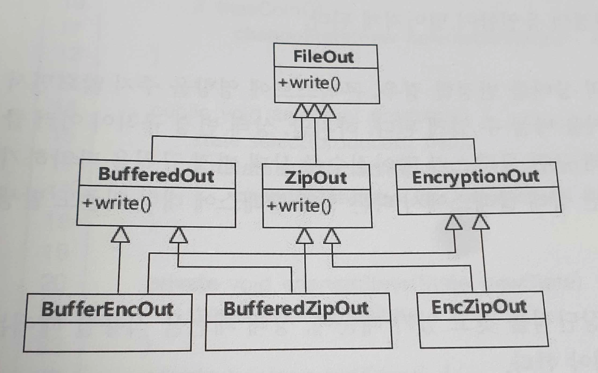
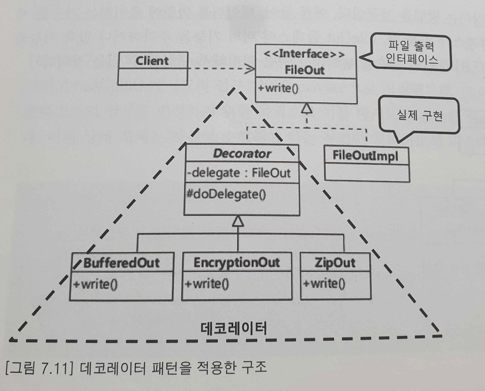

# Decorator Pattern

'상속'은 기능을 확장하기 위한 쉬운 도구이지만 '다양한 조합'의 기능 확장이 요구될 때에는 클래스가 불필요하게 중가되는 문제가 발생

데코레이터 패턴은 '상속'이 아닌 '위임(delegation)'의 방식을 선택하여 기능을 확장

## 활용
- 객체가 상황에따라 다양한 기능을 조합하여야 하는 경우 
- 기능 확장시에 기존 객체를 수정하지 않고 확장해야 하는 경우 (OCP)

### 예제
- 기존에 파일을 출력하는 기능을 확장하는 요구사항 발생
- 파일에 출력해야할 데이터를 버퍼에 저장, 암호화, 압축 하여 파일에 쓰도록 기능 확장

### 데코레이터의 장점
1. 객체에 동적으로 기능 추가가 가능하다.
2. 기존 코드의 수정하는것이 아니라, 데코레이터를 조합하는 식으로 확장 할 수 있다.
3. 상속보다 유연하다
4. 각 확장 기능및 기존 기능을 서로 영향 없이 변경할 수 있도록 만들어 준다.

### 데코레이터 패턴을 적용할 때, 고려할 점
1. 객체의 비정상적인 동작에 대한 처리
2. 자잘한 데코레이터 클래스들이 무수히 생기는 것
3. 사용자 입장에서 데코레이터 객체와 실제 구현 객체의 구분이 되지 않기 때문에 코드만으로는 기능이 어떻게 동작하는지 이해하기 어려울 수 있음(런타임에 생성된 객체 구조 이해해야함)

