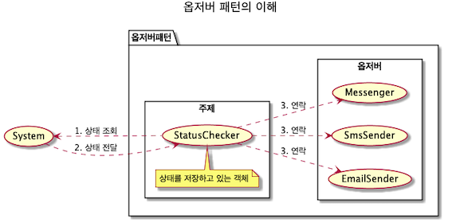
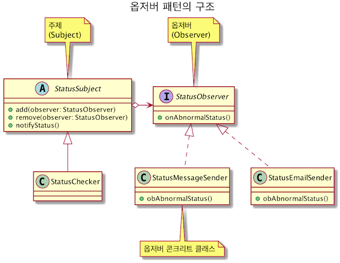

# 옵저버(Observer) 패턴

## 정의
- 한 객체의 상태 변화를 이 객체에 의존하는 다른 객체들에게 통지되는 방식으로 일대다 의존성을 가지는 디자인 패턴


 
## 구조 
- 주제 객체와 옵저버 객체가 `느슨하게 결합(loose coupling)`되어 있는 객체 디자인




### 발견된 객체지향 원칙
- SRP 원칙: 옵저버 콘크리트 클래스는 하나의 책임을 가진다.
- OCP 원칙: 옵저버 콘크리트 클래스의 확장에 열려있고 주제 클래스의 변경에는 닫혀있다. 
- DIP 원칙: 주제 클래스와 옵저버 콘크리트 클래스는 옵저버 인터페이스에 의존한다.

## 주제(subject) 객체의 두 가지 책임
- 옵저버 목록을 관리하고, 옵저버를 `등록(Add)`하고 `제거(Remove)`할 수 있는 메서드 제공
- 상태의 변경이 발생하면 등록된 옵저버에 변경 내역을 `알린다.(Notify)`

## 옵저버 패턴 구현의 고려 사항
- 주제 객체의 통지 기능 실행 주체
    - `CASE` 한 개의 주제 객체 상태가 바뀔 때마다 옵저버에게 통지를 해 주어야 한다면, 주제 객체에서 직접 통지 기능을 실행
    ```java
      /** 주제 객체에서 직접 통지 기능을 실행하는 코드 예제 **/
      public class StatusChecker extends StatusSubject {
        
        public void check() {
          Status status = loadStatus();
  
          if (status.isNotNormal()) {
            super.notifyStatus(status); // StatusChecker가 옵저버에 대한 통지 요청
          }
        }
      }
    ```
    - `CASE` 한 개 이상의 주제 객체의 연속적인 상태 변경 이후에 옵저버에게 통지를 해야한다면, 주제 객체의 상태를 변경하는 코드에서 통지 기능을 실행
    ```java
      /** 주제 객체의 상태를 변경하는 코드에서 통지 기능을 실행하는 코드 예제 **/
      StatusChecker checker1 = ...;
      StatusChecker checker2 = ...;

      checker1.check();
      checker2.check();
  
      if (checker1.isLastStatusFault() && checker2.isLastStatusFault()) {
        checker1.notifyStatus();  // 옵저버에 통지 기능 실행
        checker2.notifyStatus();  // 옵저버에 통지 기능 실행
      }
    ```
  
- 옵저버 인터페이스의 분리
    - `BAD` 모든 종류의 상태 변경을 하나의 옵저버 인터페이스로 처리할 경우, 옵저버 인터페이스는 거대해진다.
    ```java
      /** 거대한 인터페이스 코드 예제 **/
      public interface EventObserver {
        public void onClick(View v);
        public void onScroll(View v);
        public void onTouch(View v);    
      }
    ```
    ```java
      /** 거대한 인터페이스의 구현체 코드 예제 **/
      public class OnlyClickObserver implements EventObserver {
        public void onClick(View v) {
          ... // 이벤트 처리 코드
        }
  
        public void onScroll(View v) { /* 불필요한 빈 구현 */}
        public void onTouch(View v) { /* 불필요한 빈 구현 */}
        ... // 불필요한 다른 메서드의 빈 구현
      }
    ```
    - `GOOD` 상태 변경 내역에 따라 인터페이스를 분리 (ISP 원칙)
    ```java
      /** 인터페이스 분리 코드 예제 **/
      public interface ClickEventObserver {
        public void onClick(View v); 
      }
    ```
    ```java
      public interface ScrollEventObserver {
        public void onScroll(View v);  
      }
    ```
    ```java
      public interface TouchEventObserver {
        public void onTouch(View v);    
      }
    ```
    ```java
      /** 분리한 인터페이스의 구현체 코드 예제 **/
      public class OnlyClickObserver implements ClickEventObserver {
        public void onClick(View v) {
          ... // 이벤트 처리 코드
        }
      }
    ```
- 통지 시점에서 주제 객체의 상태에 결함이 없어야 한다.
    - `BAD` 옵저버 객체가 올바르지 않는 상태 값을 사용하게 되는 상황
    ```java
      /** 완전하지 못한 상태값을 조회하는 코드 예제 **/
      public class AnySubject extends SomeSubject {
  
        @Override
        public void changeState(int newValue) {
          super.changeState(newValue); // 상위 changeState()에서 옵저버에 통지
  
          // 아래 코드가 실행되기 전에 옵저버가 상태를 조회
          if (isStateSome()) {
            state += newValue;  // 상태 변경
          }
        }
      }
    ```
    - `GOOD` 옵저버 객체가 올바른 상태 값을 사용하게 되는 상황
    ```java
      /** 상태 변경과 통지 기능에 템플릿 메서드 패턴을 적용하여 상태 결함 방지 예제 **/
      // 상위 클래스
      public class SomeSubject {
  
        // 테플릿 메서드로 구현
        public void changeState(int newState) {
          internalChangeState(newState);
          notifyObserver();
        }
  
        protected void internalChangeState(int newState) {
          ...
        }
      }
    ```
    ```java
      // 하위 클래스
      public class AnySubject extends SomeSubject {
  
        // internalChangeState() 메서드 실행 이후에, 옵저버에 통지
        @Override
        protected void internalChangeState(int newValue) {
          super.internalChangeState(newValue);
          if (isStateSome()) {
            state += newValue;
          }
        }
      }
    ```
- 옵저버 객체의 실행 제약 조건
    - `BAD` 각 옵저버 객체의 실행에 대한 제약을 정하지 않았다면, 다른 옵저버의 실행이 지연되는 상황이 발생할 수도 있다.
    ```java
      private void notifyToObserver() {
        for (StatusObserver o : observers) {  // 옵저버 10개
          o.onStatusChange(); // 각 실행 시간이 10분 이상 걸린다면?
        } 
      }
  
      public void changeState(int newState) {
        internalChangeState(newState);
        notifyToObserver(); // 총 100분 이상 기다려야 한다.
      }
    ```
    - `GOOD` 수 초 이내에 응답해야 하고 긴 작업을 수행해야할 경우 별도 쓰레드로 실행해야 한다는 등의 제약 조건이 필요

## 옵저버 패턴과 발행-구독(publisher-subscriber) 패턴의 차이점

- 가장 큰 차이점은 중간에 Message Broker나 Event Bus가 존재하는지 여부
- Observer 패턴은 Subject가 Observer를 인지하지만 Pub-Sub패턴의 경우 서로를 전혀 몰라도 상관없다.
- Observer 패턴에 비해 Pub-Sub 패턴이 더 결합도가 낮다.(Loose Coupling)
- Observer 패턴은 대부분 동기(synchronous) 방식으로 동작하나 Pub-Sub패턴은 대부분 비동기(asynchronous) 방식으로 동작한다.
    - 이유는 Broker로 MessageQueue를 많이 사용하기 때문
- Observer 패턴은 단일 도메인 하에서 구현되어야 하나 Pub-Sub 패턴은 크로스 도메인 상황에서도 구현이 수월하다.
    - 어플리케이션의 도메인이 다르더라도 MessageQueue(Broker)에 접근만 가능하다면 처리가 가능하기 때문
