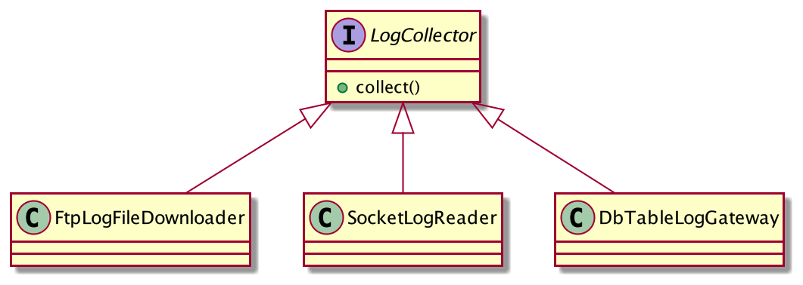

# 다형성과 추상타입

# **다형성과 상속**

다형성: 한 객체가 여러 타입을 가질 수 있는 것 ( 추상적인 타입으로 지정되어 있지만, 실제 구현체 인스턴스의 타입에 따라 역할을 달리할 수도 있는 것 )

다형성은 (자바와 같은 정적 타입 언어에서는) 타입 상속을 통해서 구현한다

타입 상속의 종류는 두가지로 나뉜다.

## 타입 상속을 통한 다형성 구현 방법

### 인터페이스 상속

- 추상화 된 타입으로 정의된 인터페이스를 구현하는 것 (`implements`)
- 순전히 타입 정의만을 상속받는 것

### 구현 상속

- 추상화 된 타입으로 구현된 클래스를 상속하는 것 (`extends`)
- 보통 상위 클래스에 정의된 기능을 재사용하기 위한 목적으로 사용됌

# **추상화**

추상화는 데이터나 프로세스등을 의미가 비슷한 개념이나 표현으로 정의하는 과정

위 추상화 과정을 거쳐 추상화하면 자연스레 인터페이스를 도출할 수 있다.

추상화된 타입은 수행할 기능의 시그니처만 정의 할 뿐 실제 구현을 제공하지 않기 때문에, 상세 구현에 대해서는 알 수 없다.

추상화는 실은 반드시 `interface` 혹은 `abstract class` 를 정의하는 것을 뜻하는게 아니다.

## 추상 타입과 실제 구현의 연결



```java
// createLogCollector()는 알맞은 구현 클래스의 객체를 생성하고 반환
LogCollector collector = createLogCollector();
collector.collect(); // 다형성에 의해 구현된 위 세 클래스 중 하나의 타입의 collect 메서드 호출

```