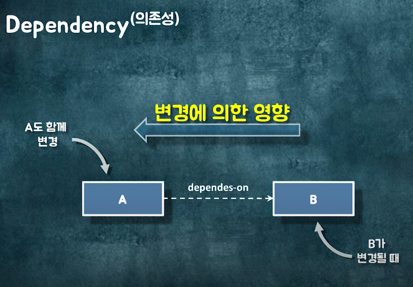
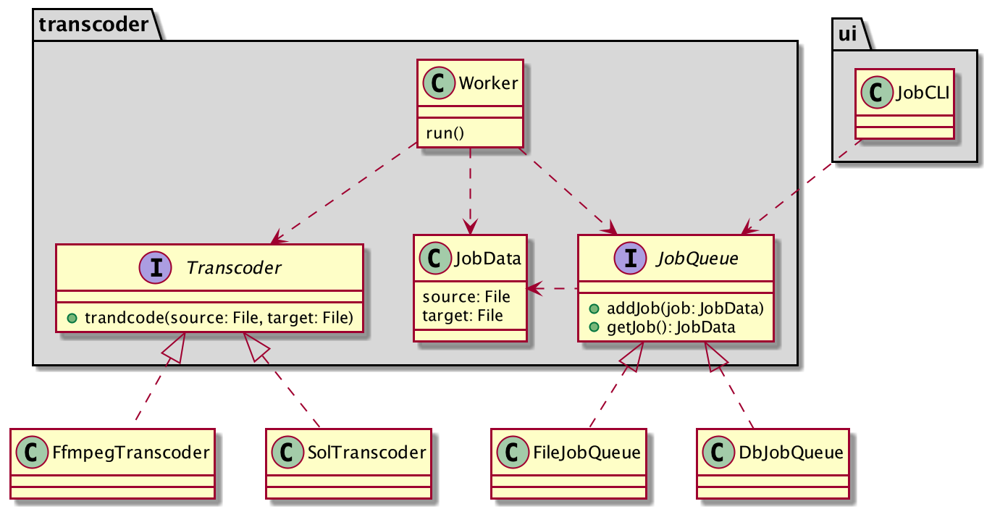
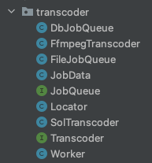

# DI와 서비스로케이터

# Dependency(의존성)

어떤 변경일지는 모르겠지만, B가 변경될 때 A도 변경될 수 있는 가능성이 있을 때

설계를 잘~하면 A가 B를 의존하고 있고, B의 내부구현이 변경되더라도 A는 전혀 영향받지 않을 수 있다.

`변경에 의해서 영향을 받을 수 있는 가능성`



객체의 기능 사용을 위해 의존성을 가질 수는 있으나, 어떠한 객체를 변경할 때 다른 객체까지 영향 받는 구조는 유지보수성이 떨어지므로, 낮은 결합을 위해 의존 역전 원칙(DIP)을 지키는 것이 중요하다.

--- 

# 애플리케이션 영역과 메인 영역

**어플리케이션 영역**: 고수준 정책 및 저수준 구현
`고수준`: 추상성이 높으며, 의미있는 단일 기능을 제공하는 모듈
`저수준`: 고수준 모듈의 기능을 구현하기 위한 하위 기능의 실제 구현

**메인 영역**: 어플리케이션이 동작하도록 각 객체들을 연결

## 간단한 비디오 포맷 변환기 프로그램(Transcoder)

- 파일의 확장자를 이용해서 비디오 파일의 포맷을 변환한다.
- 변환 요청을 등록하면 순차적으로 변환 작업 수행한다
    - 변환 요청 정보는 파일 또는 DB를 이용해서 보관할 수 있어야 한다.
- 비디오 형식의 변환 처리는 오픈소스인 ffmpeg를 이용하거나 변환 솔루션을 사용할 수 있어야 한다.
- 명령 행에서 변환할 원본 파일과ㅏ 변환 결과로 생성될 파일을 입력한다.


```java
public class JobCLI {
  public void interact() {
    printInputSourceMessage();
    String source = getSourceFromConsole();
    printInputTargetMessage();
    String target = getTargetFromConsole();
    JobQueue jobQueue = ...;
    jobQueue.addJob(new JobData(source, target));
  }

  ...
}
```

```java
public class Worker {
  public void run() {
    JobQueue jobQueue ...;
    Transcoder transcoder ...;

    while(condition) {
      JobData jobData = jobQueue.getJob();
      transcoder.transcode(jobData.getSource(), jobData.getTarget());
    }
  }
}
```

위 `Worker`, `JobCLI` 클래스가 제 기능을 하기 위해서는 `JobQueue` 혹은 `Transcoder`에 타입에 올 구현체가 필요하다.

DIP를 지키기 위해 고수준 모듈을 의존하게끔 설계했더라도 어딘가에서는 콘크리트 클래스의 인스턴스를 주입해주어야 한다.

### 애플리케이션 영역에서 사용할 객체를 제공 해줄 Locator 구현 예시

구현체를 찾아서 주입해줄 역할은 아래 `Locator`가지고 있고 이 객체를 사용하기로 결정했다고 가정

```java
public class Locator {
  private static Locator instance;
  private JobQueue jobQueue;
  private Transcoder transcoder;

  public static Locator getInstance() {
    return instance;
  }

  public static void init(Locator locator) {
    instance = locator;
  }

  public Locator(JobQueue jobQueue, Transcoder transcoder) {
    this.jobQueue = jobQueue;
    this.transcoder = transcoder;
  }

  public JobQueue getJobQueue() { return jobQueue; }
  public Transcoder getTranscoder() { return transcoder; }
}
```

Locator 클래스는 Worker 클래스와 같은 패키지인 transcoder 패키지에 위치

만약 locator라는 패키지를 만들어 locator 패키지에 위치시키면 locator 패키지와, transcoder 패키지는 서로 의존관계를 가지게 되어 순환의존이 발생한다.



`Worker`, `JobCLI`는 `Locator`에게 필요한 객체를 제공받아 사용하면 되므로 해결이 되었지만, `Locator`에겐 누가 객체를 초기화 해줄까? 

또한 `JobCLI` 객체, `Worker` 객체의 기능 또한 어디선가 호출이 되어야 할텐데, 어떤 객체가 호출 해줄것인가?

## 메인 영역

메인 영역은 다음 작업을 수행한다.

1. 애플리케이션 영역에서 사용될 객체를 생성한다.
2. 각 객체 간의 의존 관계를 설정한다.
3. 애플리케이션을 실행한다.

```java
public class Main {

  public static void main(String[] args) {
    // 메인영역은 애플리케이션에 의존하고 있으나, 애플리케이션영역은 메인에 의존하지 않으므로,
    // 메인영역이 변경되더라도 애플리케이션은 변경될 가능성이 없어 어떠한 영향도 끼치지 않는다.
    // 객체를 사용하기 위해선 이곳(메인영역)이 변경되어야 한다.

    // 애플리케이션 영역에서 사용될 객체(저수준 모듈)를 생성한다.
    JobQueue jobQueue = new FileJobQueue();
    Transcoder transcoder = new FfmpegTranscoder();

    // 각 객체 간의 의존 관계 설정, 고수준 모듈이 저수준 모듈을 사용할 수 있도록 콘크리트 클래스 초기화
    Locator locator = new Locator(jobQueue, transcoder);
    Locator.init(locator);

    // 애플리케이션 영역 실행
    final Worker worker = new Worker();
    Thread t = new Thread(worker);
    t.start();
    JobCLI cli = new JobCLI();
    cli.interact();
  }

}
```

__Locator__: 객체들을 연결

__Main__: Locator를 통해서 Worker와 JobCLI 객체가 필요로 하는 객체를 설정

이렇게 사용할 객체를 제공하는 책임을 갖는 객체를 서비스 로케이터(`Service Locator`)라고 부른다.

하지만 서비스 로케이터는 아래와 같은 몇가지 단점이 있어 일반적인 경우에는 잘 사용되지 않는다.

- 인터페이스 분리 원칙(ISP) 위반
이 예에서 ServiceLocator는 JobQueue와, Transcoder에 의존하고 있으나 JobCLI는 JobQueue에 대한 의존만 갖고 있다. 그러나 JobQueue만 제공받는 것이 아니라 Transcoder까지 제공받을 수 있는 불필요한 의존이 발생한다. (의존 객체마다 서비스로케이터를 작성해주면 해결)
- 동일 타입의 객체가 다수 필요할 경우 제공 메서드를  객체별로 만들어주어야 한다.

# DI를 이용한 의존 객체 사용

```java
public class Worker implements Runnable {
  // 직접 생성할 경우 콘크리트 클래스에 대한 의존이 발생하기 때문에 사용할 객체의 생성을 뒤로 미룬다.
  // 언제까지? 이 객체가 생성되는 시점, 혹은 필요한 객체를 설정하는 시점
  JobQueue jobQueue;
  Transcoder transcoder;

	// 이 객체가 생성되는 시점에 주입받는 경우
  public Worker(JobQueue jobQueue, Transcoder transcoder) {
    this.jobQueue = jobQueue;
    this.transcoder = transcoder;
  }

	...
}
```

```java
public class JobCLI {
  private JobQueue jobQueue;

  public JobCLI(JobQueue jobQueue) {
    this.jobQueue = jobQueue;
  }

  ...
}
```

```java
public class Main {

  public static void main(String[] args) {
    // 저수준 모듈 객체 생성
    // 객체를 사용하기 위해선 이곳(메인영역)이 변경되어야 한다.
    // 메인영역은 애플리케이션에 의존하고 있으나, 애플리케이션영역은 메인에 의존하지 않으므로,
    // 메인영역이 변경되더라도 애플리케이션은 변경될 가능성이 없어 어떠한 영향도 끼치지 않는다.

    // 애플리케이션 영역에서 사용될 객체를 생성한다.
    JobQueue jobQueue = new FileJobQueue();
    Transcoder transcoder = new FfmpegTranscoder();

    // 각 객체 간의 의존 관계 설정, 고수준 모듈이 저수준 모듈을 사용할 수 있도록 콘크리트 클래스 주입
    // 애플리케이션 영역 실행
    final Worker worker = new Worker(jobQueue, transcoder);
    Thread t = new Thread(worker);
    t.start();
    JobCLI cli = new JobCLI(jobQueue);
    cli.interact();
  }

}

```

Main에서 객체들이 필요한 객체를 주입해준다. 이것을 외부에서 의존하는 객체를 넣엊귀 때문에 의존성 주입이라고 부른다.

DI를 통해서 의존 객체를 관리할 때에는 객체를 생성하고 각 객체들을 의존 관계에 따라 연결해주는 조립 기능이 필요하다. 

위 코드에서는 Main 이 조립기의 역할을 담당하지만 조립기 또한 별도로 분리하면 향후 변경의 유연함을 더 얻을 수 있다.

객체 조립 역할을 수행하는 Assembler 클래스

```java

public class Assembler {
  private Worker worker;
  private JobCLI jobCLI;

  public void createAndWire() {
    // 애플리케이션 영영엑서 사용할 객체를 생성하고 생성자에 의존 객체를 주입해준다.
    JobQueue jobQueue = new FileJobQueue();
    Transcoder transcoder = new FfmpegTranscoder();

    // 실행 대상이 되는 객체를 제공하기 위해 생성
    this.worker = new Worker(jobQueue, transcoder);
    this.jobCLI = new JobCLI(jobQueue);
  }

  // 실행 대상이 되는 객체 제공
  public Worker getWorker() {
    return worker;
  }

  public JobCLI getJobCLI() {
    return jobCLI;
  }
}
```

```java
public class Main {
  public static void main(String[] args) {
    Assembler assembler = new Assembler();
    assembler.createAndWire();
    Worker worker = assembler.getWorker();
    JobCLI jobCLI = assembler.getJobCLI();
    new Thread(worker).start();
    jobCLI.interact();
  }
}
```

위와 같이 객체 조립 기능이 분리되면 이후에 구성 파일(xml 등)에 의한 객체 생성과 조립에 대한 정보를 설정하고 초기화 할 수 있도록 구현을 변경할 수 있다.

## 생성자 방식, 설정 메서드 방식

DI를 할 때는 크게 두가지 방식이 존재한다.

- 생성자 방식(constructor)
- 설정 메서드 방식(setter)

위 예에서는 이미 생성자 방식을 살펴보았다.

설정 메서드 방식의 구현

```java
public class Worker implements Runnable {
  // 직접 생성할 경우 콘크리트 클래스에 대한 의존이 발생하기 때문에 사용할 객체의 생성을 뒤로 미룬다.
  // 언제까지? 이 객체가 생성되는 시점, 혹은 필요한 객체를 설정하는 시점
  JobQueue jobQueue;
  Transcoder transcoder;

	// 이 객체가 생성된 이후 필요한 객체를 설정하는 시점 구현
	public void setJobQueue(JobQueue jobQueue) {
    this.jobQueue = jobQueue;
  }

  public void setTranscoder(Transcoder transcoder) {
    this.transcoder = transcoder;
  }
}
```

```java
public class JobCLI {
  private JobQueue jobQueue;

  public void setJobQueue(JobQueue jobQueue) {
    this.jobQueue = jobQueue;
  }
}
```

혹은 메서드 체이닝이 가능하도록 다음과 같이 구현

```java
public class Worker implements Runnable {
  // 직접 생성할 경우 콘크리트 클래스에 대한 의존이 발생하기 때문에 사용할 객체의 생성을 뒤로 미룬다.
  // 언제까지? 이 객체가 생성되는 시점, 혹은 필요한 객체를 설정하는 시점
  JobQueue jobQueue;
  Transcoder transcoder;

	public void configure(JobQueue jobQueue, Transcoder transcoder) {
    this.jobQueue = jobQueue;
    this.transcoder = transcoder;
  }

  public Worker setJobQueue(JobQueue jobQueue) {
    this.jobQueue = jobQueue;
    return this;
  }

  public Worker setTranscoder(Transcoder transcoder) {
    this.transcoder = transcoder;
    return this;
  }
}
```

DI 프레임워크에 따라 DI 설정 메서드 구현은 달라질 수 있다.

### 각 방식의 장단점

**생성자방식**

- 생성자 방식은 생성 시점에 의존 객체를 모두 받기 때문에, 한 번 객체가 생성되면 객체가 정상적으로 동작함을 보장할 수 있다.
- 하지만 의존 객체가 먼저 생성되어 있어야 하므로 의존 객체를 먼저 생성 할 수 없다면 사용할 수 없다.

**설정 메서드 방식**

- 객체를 생성한 뒤에 의존 객체를 주입하게 되므로, 의존 객체를 설정하지 못한 상태에서 객체를 사용한다면 NPE(NullPointerException)가 발생할 수 있다.
- 객체를 생성한 이후에 의존 관계를 설정해야만 하거나, 의존할 객체가 많을 경우 생성자 방식에 비해 보다 가독성을 높일 수있다.

## DI와 테스트

단위 테스트: 한 클래스의 기능을 테스트하는에 초점을 맞춘다.

DI는 의존 객체를 Mock객체로 쉽게 대체할 수 있도록 함으로써 단위 테스트를 할 수 있도록 돕는다.

Worker의 run 기능을 테스트 하기 위해서는 Worker의 의존관계에 상관없이 run기능에 관심을 두고 있지만 

현재 의존을가지는 객체가 명확하게 구현되지 않은 상황이라면?
**DI 사용시**: Mock 객체를 구현하거나 테스트 프레임워크를 통해 Mock 객체를 생성하여 주입해주면 되므로 테스트가 용이해진다.

**DI 미사용시**: 직접 테스트에 필요한 의존 객체를 임시로 구현해야 하고, 구현하는 과정에서 의존관계의 범위 코드까지 영향을 끼쳐 불편해진다.

```java
@Test
public void shouldRunSuccessfully() {
  JobQueue mockJobQueue = ...
  Transcoder mockTranscoder = ...

  Worker worker = new Worker(mockJobQueue, mockTranscoder);
  worker.run();
}
```

> 참고
> > - [https://justhackem.wordpress.com/2016/05/13/dependency-inversion-terms/](https://justhackem.wordpress.com/2016/05/13/dependency-inversion-terms/)
> > - [https://www.youtube.com/watch?v=dJ5C4qRqAgA](https://www.youtube.com/watch?v=dJ5C4qRqAgA)
