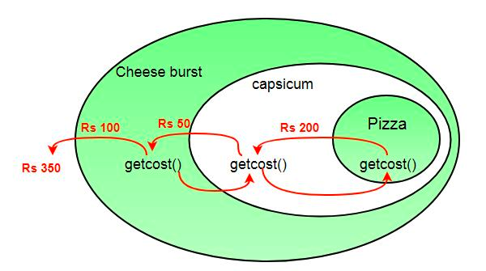
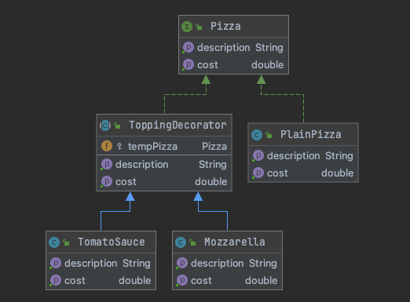

# 데코레이터 패턴

- 특정 클래스의 객체들이 할 수 있는 일을 여러가지 두고, 각 객체마다 사용자가 원하는대로 골라 시키거나, **기능들을 필요에 따라 장착 할 수 있도록 할 때**
- 객체의 결합을 통해 기능을 동적으로 유연하게 확장 할 수 있게 해주는 패턴, **중심이 되는 객체가 반환하는 값에 추가적으로 더해져 결과값을 반환하려고 할 때**
- 상속이 아닌 위임하는 방식으로 기능을 확장해 간다.
    - 확장을 위해 구현 클래스를 상속받지 않고, Decorator 추상클래스를 만든다.
    - Decorator를 상속받아 기능을 확장한다.

## 장점

- 런타임에 기능을 확장 할 수 있다.
- 상속보다 유연하며 코드를 단순화시킨다.

## 단점

- 데코레이터 클래스가 증가한다.
- 객체가 랩핑되어 있어 객체의 정체를 알기 힘들고 복잡해질 수 있다.



```java
public interface Pizza {
  String getDescription();
  double getCost();
}
```

위와 같은 피자 타입 객체가 여러개가 필요할 경우 일반적으로 상속을 이용하여 다음과 같이 구현할 것이다.

```java
public class PlainPizza implements Pizza {

  public PlainPizza() {
    System.out.println("도우를 추가합니다.");
  }

  @Override
  public String getDescription() {
    return "일반 얇은 도우 피자";
  }

  @Override
  public double getCost() {
    return 4.00;
  }
}
```

```java
public class MozzarellaPizza implements Pizza {

  public PlainPizza() {
    System.out.println("모짜렐라를 추가합니다.");
  }

  @Override
  public String getDescription() {
    return "모짜렐라 피자";
  }

  @Override
  public double getCost() {
    return 10.00;
  }
}
```

하지만 실제로 피자는 개별 항목을 기준으로 가격이나, 재료 구성이 이루어지는데, 위와 같은 구조로는 개별구조가 아닌 클래스가 계층 구조로 파생될 것이다.

그렇다면 피자를 이루고 있는 객체를 유연하게 확장시킬 수 있는 구조는 어떻게 구현할 수 있을까? 답은 데코레이터 패턴에 있다.

피자의 토핑 구성을 장식할 수 있는 구조의 객체를 설계하면 된다. 이것을 데코레이터 패턴이라고 부른다.

다음과 같은 구조가 될것이다. `Pizza`의 구현체를 생성하거나, `PlainPizza`를 상속받지 않고, Pizza를 상속받는 `ToppingDecorator` 추상클래스를 생성하고, 추후에 `Pizza`의 토핑으로 장식되어질 피자 객체들은 `ToppingDecorator` 추상클래스를 상속받게 하고 기능을 구현한다.



어떤 피자 타입의 객체를 주입받아 해당 피자객체를 장식해줄 Decorator 객체이다.

```java
public abstract class ToppingDecorator implements Pizza {
  protected Pizza tempPizza;

  public ToppingDecorator(Pizza newPizza) {
    this.tempPizza = newPizza;
  }

  @Override
  public String getDescription() {
    return tempPizza.getDescription();
  }

  @Override
  public double getCost() {
    return tempPizza.getCost();
  }
}
```

모짜렐라는 $0.50 의 가격이 책정되어있고, 이 가격을 피자 객체에 장식해줄 것이다.

```java
public class Mozzarella extends ToppingDecorator {
  public Mozzarella(Pizza newPizza) {
    super(newPizza);
		// 도우를 추가한 피자인 newPizza에 모짜렐라를 장식
    System.out.println("모짜렐라를 추가합니다.");
  }

  @Override
  public String getDescription() {
    return super.getDescription() + ", 모짜렐라";
  }

  @Override
  public double getCost() {
    return super.getCost() + .50;
  }
}
```

```java
public class TomatoSauce extends ToppingDecorator {

  public TomatoSauce(Pizza newPizza) {
    super(newPizza);
		// 모짜렐라를 추가한 피자인 newPizza에 토마토 소스를 장식
    System.out.println("토마토 소스를 추가합니다.");
  }

  @Override
  public String getDescription() {
    return super.getDescription() + ", 토마토소스";
  }

  @Override
  public double getCost() {
    return super.getCost() + .35;
  }
}

```

최종적으로 main 영역에서 피자를 조합하여 피자 완성본을 만들어본다.

```java
public class PizzaMaker {

  public static void main(String[] args) {
    Pizza basicPizza = new TomatoSauce(new Mozzarella(new PlainPizza()));

    System.out.println("재료: " + basicPizza.getDescription());
    System.out.println("가격: " + basicPizza.getCost());
  }

```

**출력**

도우를 추가합니다.
모짜렐라를 추가합니다.
토마토 소스를 추가합니다.
재료: 도우, 모짜렐라, 토마토소스
가격: 4.85

[코드 Link](https://github.com/thxwelchs/oop-design-pattern/tree/master/src/main/java/decorator)


# 참고

> [https://scorpio-mercury.tistory.com/19](https://scorpio-mercury.tistory.com/19)
[https://www.youtube.com/watch?v=j40kRwSm4VE](https://www.youtube.com/watch?v=j40kRwSm4VE)