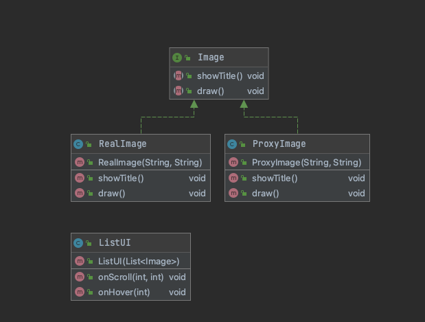

# 프록시 패턴

- 다른 클래스에 대한 액세스를 제한하는 데 사용
- 꼭 필요로 하는 시점까지 객체의 생성을 지연시키고 해당 객체가 생성된 것처럼 동작하도록 할 때 사용
- 실제 사용하려는 객체에 비교적 가벼운 작업만 처리할 수 있도록 할 때 사용 ( 무거운 작업은 실제 객체에게 위임 )

**클라이언트 입장에서 사용할 객체가 들어갈 자리에 대리자 객체를 투입하여 처리하도록 하는 것**

프록시 객체는 흐름의 제어만 할 뿐 결과값을 조작하면 안된다.

# 장점

- 실제 객체의 메소드들을 은닉화 할 수 있다.
- 실제 객체를 지연로딩시켜 불필요한 메모리 로드를 방지 할 수 있다. ( 간단하고 가벼운 작업만 프록시 객체를 생성하여 프록시에서 처리하다가 무거운 작업일 경우 실제 객체에게 위임하여 처리 할 수 있음)
- 프록시에서 클라이언트와 실제 객체의 인터페이스를 담당하기 때문에 보안적인 요소를 추가 할 수 있다.

# 단점

- 실제 객체 외에 다른 객체가 중간에 끼워지는 형태이기 때문에 어찌되었건 메모리는 더 소모된다. (모든기능을 사용한다고 했을 때)
- 프록시 내부에서 멀티쓰레드 프로그래밍, 동기화가 구현되야 하는 경우 성능이 저하될 수 있다.

[코드 Link](https://github.com/thxwelchs/oop-design-pattern/tree/master/src/main/java/proxy)

# 참고

> [https://www.youtube.com/watch?v=cHg5bWW4nUI](https://www.youtube.com/watch?v=cHg5bWW4nUI)
[https://limkydev.tistory.com/79](https://limkydev.tistory.com/79)
[https://coding-factory.tistory.com/711](https://coding-factory.tistory.com/711)