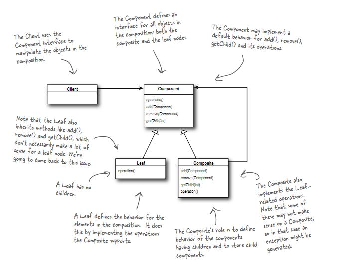

# 12. Composite Pattern

### Motivation

- 장비들의 전원을 관리하는 제어 프로그램 개발중
- 개별 장비 & 장비들을 묶어서 관리하고자 하는 요구사항

```java
public class PowerController {

    public void turnOn(Long deviceId) {
        Device device = findDeviceById(deviceId);
        device.turnOn();
    }

    public void turnGroupOn(Long groupId) {
        DeviceGroup group = findGroupById(groupId);
        group.turnOn();
    }
}
```

`코드 중복` 발생:
- 동일한 동작 (power on)에 `Device`와 `DeviceGroup`을 구분해서 처리중
- 코드 중복 -> 복잡도 증가 -> 코드의 수정이나 확장이 어려움
- 새로운 기능 (e.g. 소비 전력 측정)이 추가되면 비슷한 method 2개 추가


### 해결책: Composite pattern

> Composite pattern을 이용하면 객체들을 트리 구조로 구성하여 부분과 전체를 나타내는 계층구조를 만들 수 있습니다.
> 이 패턴을 이용하면 클라이언트에서 개별 객체와 다른 객체들로 구성된 복합 객체(composite)를 똑같은 방법으로 다룰 수 있습니다.

> Composite pattern에서 composite는 다음의 책임을 갖는다:
> - Component 그룹을 관리한다.
> - Component에 기능 실행을 요청하면, composite는 포함하고 있는 component들에게 기능 실행 요청을 위임한다. 

```java
public interface Device {
    public void turnOn();
    public void turnOff();
}

public class DeviceGroup implements Device {
    private List<Device> devices = new ArrayList<Device>();

    public void addDevice(Device device) { devices.add(device); }

    public void removeDevice(Device device) { devices.remove(device); }

    public void turnOn() { devices.forEach(Device::turnOn); }

    public void turnOff() { devices.forEach(Device::turnOff); }
}
```



### 장점 1

클라이언트는 component 또는 composite 여부와 상관 없이 단일 인터페이스로 기능을 실행할 수 있다:

```java
public class PowerController {

    public void turnOn(Long deviceId) {
        Device device = findDeviceById(deviceId);
        device.turnOn();
    }

    // 해당 method는 더 이상 필요 없다
//    public void turnGroupOn(Long groupId) {
//        DeviceGroup group = findGroupById(groupId);
//        group.turnOn();
//    }
}
```

### 장점 2

Composite 자체도 component이기 때문에, composite에 다른 composite를 등록할 수 있다.
- 한 층의 Light 객체들로 DeviceGroup을 생성하고 다시 각 층 별로 생성된 DeviceGroue들로 하나의 DeviceGroup 객체에 등록하면, 건물 전체의 불을 켜거나 끄는 기능을 구현할 수 있다.
- Head First Design Patterns 예제: 메뉴 / 디저트 메뉴 / 메인 요리

```java
DeviceGroup firstFloorLights = ...;
DeviceGroup secondFloorLights = ...;

DeviceGroup buildingLights = new DeviceGroup();
buildingLights.addDevice(firstFloorLights);
buildingLights.addDevice(secondFloorLights);

buildingLights.turnOn();
```

### 패턴 사용 시 고려사항

#### Summary: 

- 위의 코드에서는 component를 관리하는 인터페이스가 composite class에 정의가 되어있다. 따라서 클라이언트에서 composite를 정의하고 싶다면 `DeviceGroup` 타입에 직접 접근해야 하는 상황.
- **[Discussion 1]** `Device` 클래스에 `addDevice()` 와 `removeDevice()` method를 추가해서 해결할 수 있다
- 하지만 이렇게 구현하면, component를 추가하면 안되는 상황이 가능해진다 (e.g. `Aircon` 에 `Heater` 추가)
- **[Discussion 2]** 이를 해결하기 위해 `Device` 에 `addDevice()` 는 exception이 발생하도록 구현을 하고, `DeviceGroup` 에서 적절하게 override 하도록.


#### Discussion 1:

- `Device` 에 `addDevice()` 와 `removeDevice()` 를 추가하는게 무조건 맞는 답은 아니다.
- "Safety" vs "transparency" trade-off

> Composite pattern은 SRP를 깨면서 대신에 투명성(transparency)를 확보하기 위한 패턴이다
> (어떤 객체가 composite인지 leaf node인지 클라이언트 입장에서 *투명하게* 느껴진다)
> [...] 투명성을 확보하는 대신 안전성(safety)이 떨어지게 된다.

*"Transparency"*:
- Component와 composite를 동일한 방식으로 처리
- Leaf node (component)가 거의 발생하지 않는 구조면 transparency를 더 우선순위에 둘 수 있음

*"Safety"*:
- Leaf에서 의미없는 operation(e.g. add / remove)을 시도할 수 있음


#### Discussion 2:

Option 1: Throw exception

```java
public abstract class Device {
    public void addDevice(Device d) {
        throw new CannotAddException();
    }

    public void removeDevice(Device device) {
        // do nothing
    }

    public abstract void turnOn();
    public abstract void turnOff();
}

public class GroupDevice extends Device {
    @Override
    public void addDevice(Device device) {
        devices.add(device);
    }

    @Override
    public void removeDevice(Device device) {
        devices.remove(device);
    }
}
```

Option 2: component를 추가할 수 있는지의 여부를 확인하는 method 추가

```java
public abstract class Device {
    public boolean canContain(Device device) {
        return false;
    }

    public void addDevice(Device device) {
        if (canContain(device)) {
            devices.add(device);
        }
    }
}

public class GroupDevice extends Device {
    @Override
    public void canContain(Device device) {
        return true;
    }
}

// Composite에 포함할 수 있는 component를 제한하는 구현도 쉽게 가능하다:
public class AirconGroup extends GroupDevice {
    @Override
    public boolean canContain(Device device) {
        return (device instanceof Aircon);
    }
}
```

### Questions

Component는 abstract class 아니면 interface?
